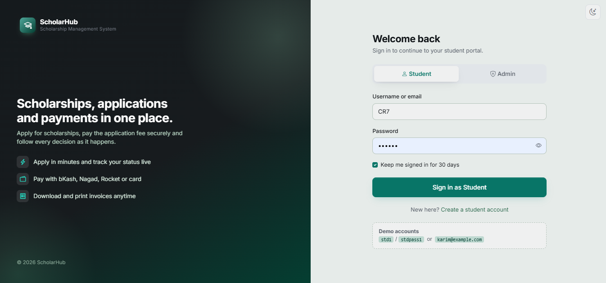
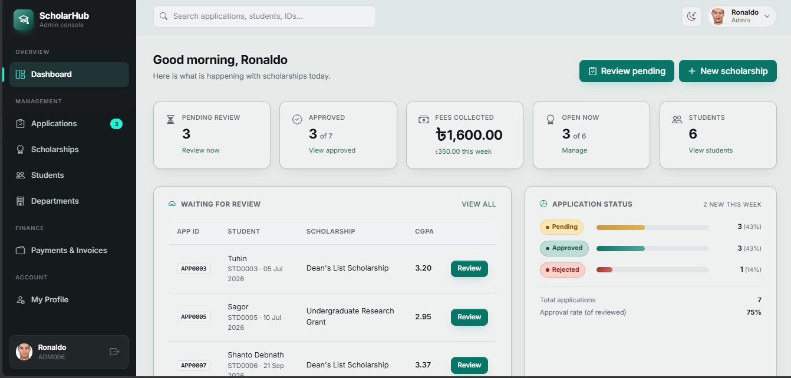
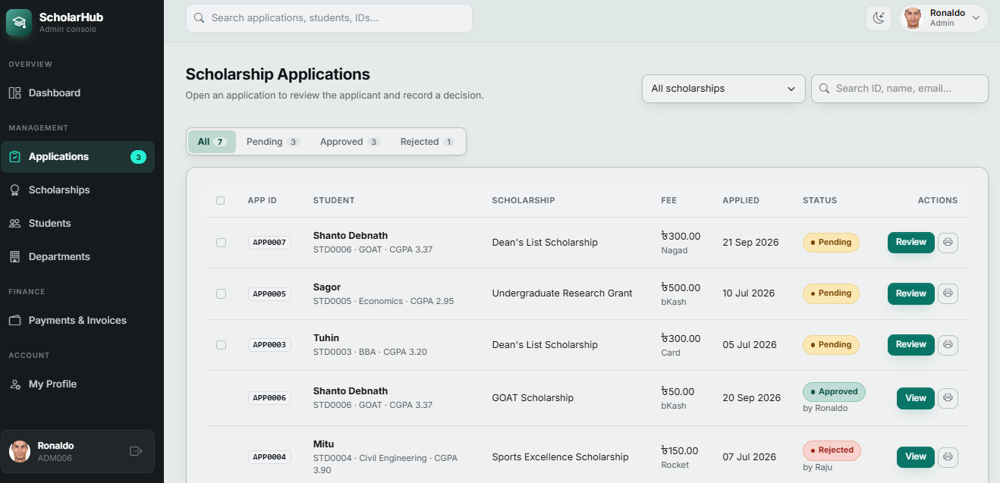
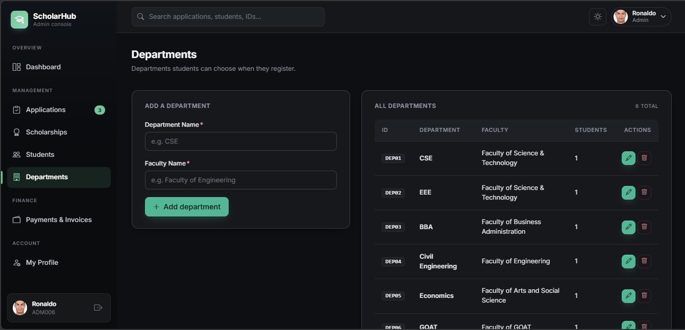
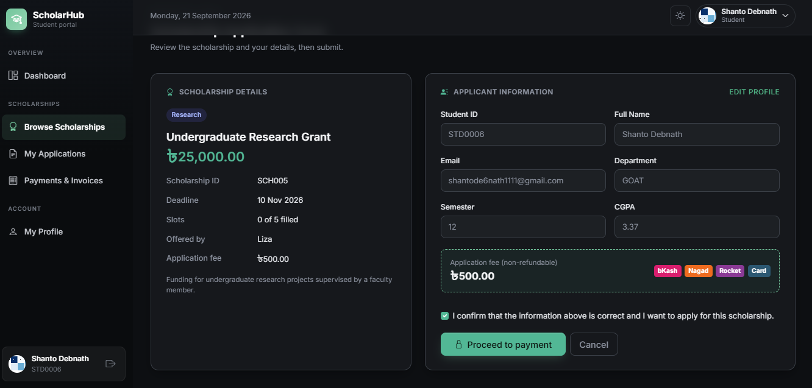
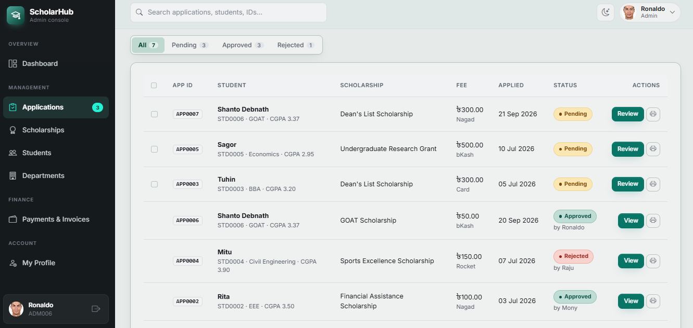

# ScholarHub — Scholarship Management System


Folder: `scholarhub` · Database: `scholarhub_db`


## Screenshots

## Screenshots

<table>
  <tr>
    <td></td>
  </tr>
  <tr>
    <td></td>
  </tr>
  <tr>
    <td></td>
  </tr>
  <tr>
    <td></td>
  </tr>
  <tr>
    <td></td>
  </tr>
  <tr>
    <td></td>
  </tr>
  <tr>
    <td></td>
  </tr>
</table>


## Features

**Student**: dashboard · browse / search scholarships (live) · apply + pay
fee · My applications (print application copy) · Payments & invoices (view /
print / save as PDF) · Profile with photo, personal, contact, academic and
guardian details, profile completion, change password, sign out other
devices, activity timeline.

**Admin**: dashboard (pending, approved, fees collected, status chart, latest
payments) · global search · Applications with live filters, **bulk approve /
reject**, print · Review page with payment details · Scholarships (fee,
description) · Students · Departments · **Payments & invoices** (filters by
status / method / date, totals by method, **CSV export**, **printable
statement**, invoice for any payment) · Admin profile with photo.

**Everywhere**: light / dark mode (remembered in a cookie), dim-white
forest-green theme, AJAX forms without page reloads, toasts, print-friendly
pages, mobile layout.

## Database (`database/scholarhub_db.sql`)

- 8 tables: `users`, `department`, `admin`, `student`, `scholarship`,
  `application`, `payment`, `remember_token`
- IDs by triggers: `USR0001`, `DEP01`, `ADM001`, `STD0001`, `SCH001`,
  `APP0001`, `PAY000001`; invoice numbers `INV-YYYY-00001`
- Stored routines: `fn_get_cgpa`, `fn_app_count`, `fn_fee_collected`,
  `proc_update_status`, `proc_get_admin_name`; triggers `trg_check_slots`,
  `trg_payment_id`, `trg_payment_complete`

## Security

CSRF tokens on every form and checkout step · prepared statements · output
escaping · bcrypt passwords · checkout steps cannot be skipped · OTP stored as
a hash, PIN never stored, card: only brand + last 4 digits · students can only
see their own payments and invoices · uploads: only real JPG / PNG / WebP ≤ 2 MB,
random file names, PHP blocked in `uploads/` · CSV export protected against
formula injection · "Remember me" tokens hashed and rotated.

## Configuration: `config/config.php`

```php
define('DB_NAME', 'scholarhub_db');
define('ADMIN_REGISTRATION_CODE', 'SH-ADMIN-2026');
define('PAYMENT_MODE', 'test');
define('MERCHANT_NAME', 'ScholarHub Scholarship Office');   // shown on invoices
define('MERCHANT_ADDRESS', '...');
define('MERCHANT_EMAIL', '...');
```

## Troubleshooting

- **"Cannot connect to MySQL"**: start MySQL in XAMPP; check `DB_USER` / `DB_PASS`.
- **Profile photo won't upload**: make sure `uploads/avatars` is writable
  (the Setup page checks this). Enable `extension=fileinfo` in `php.ini` if it is off.
- **Reset all data**: log in as admin, open `install.php`, type `RESET`.

PHP 8.0+ (XAMPP 8.x), MySQL 5.7+/8 or MariaDB 10.2+.
